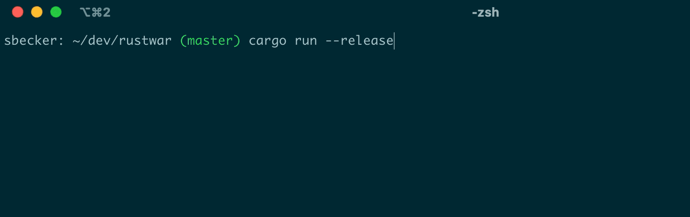

# War

How long does it take for a game of war to end?

### Run simulation
`cargo run`

### Test simulation
`cargo test`

### Simulation output
```
STARTING SIMULATION (MAX GAME LENGTH: 10000 TURNS)
Games: 100000 [SHUFFLED  ] 267.60 (Indeterminate games: 0.00%)                  
Games: 100000 [SHUFFLED  ] 267.73 (Indeterminate games: 0.00%)                  
Games: 100000 [UNSHUFFLED] 585.25 (Indeterminate games: 6.63%)                  
Games: 100000 [UNSHUFFLED] 583.84 (Indeterminate games: 6.61%)                  
SIMULATION FINISHED (40 SECONDS)
```

### Simulation preview

